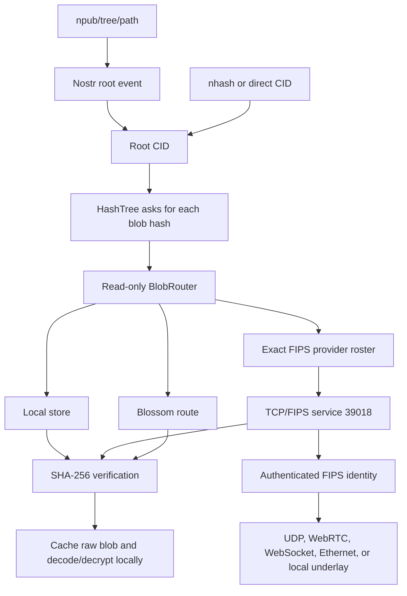

# Hashtree Networking and Peer-to-Peer Protocol

Status: implemented protocol and architecture profile, 2026-07-26.

This document describes how a Hashtree implementation finds mutable roots,
discovers peers, retrieves immutable blobs, forwards requests, and interprets
network results. It complements:

- [`HTS-01.md`](HTS-01.md), which defines content, CIDs, CHK encryption, and
  Nostr root events.
- [`tcp-fips-blob-v1.md`](tcp-fips-blob-v1.md), which is the compact reference
  for the exact blob-transfer bytes.

Normative terms such as MUST and SHOULD apply to Hashtree interoperability.
FIPS internals are described only far enough to define the boundary Hashtree
relies on; FIPS remains responsible for its own discovery, authentication,
routing, and underlay protocols.

## 1. Protocol Planes

Hashtree separates mutable naming from immutable data transfer.

| Plane | Protocol or component | Purpose |
| --- | --- | --- |
| Mutable naming | Nostr | Publish and resolve an author's current Merkle root |
| Peer discovery and signaling | FIPS discovery over Nostr, LAN, or local rendezvous | Find authenticated node identities and establish routes |
| Peer data | Hashtree blob v1 over TCP/FIPS | Request one immutable blob by SHA-256 |
| Server data | Blossom-compatible HTTP | Read or upload the same immutable blob bytes |
| Local data | `Store` implementations | Cache and serve blobs by SHA-256 |

The planes may be used independently:

- An immutable `nhash` or CID needs no Nostr root lookup.
- A client may resolve a mutable root through Nostr and then obtain every blob
  from local storage or Blossom without using P2P.
- A client may know a peer identity explicitly and use FIPS without discovering
  it from public relays.
- Nostr relays used for root lookup or FIPS signaling do not carry Hashtree blob
  payloads.



## 2. Identities and Addressed Data

### 2.1 Peer identity

A FIPS peer is identified by a Nostr secp256k1 public key, normally written as
an `npub`. The corresponding secret key identifies a device or daemon endpoint.
FIPS authenticates the peer session; transport addresses are not identities.

An IP address, relay URL, WebRTC candidate, or WebSocket seed MUST NOT be used
as the durable peer identity. FIPS may replace the route to an `npub` without
changing Hashtree's provider identity.

### 2.2 Blob identity

The only content address sent by the P2P blob protocol is:

```text
hash = SHA256(stored_blob_bytes)
```

The stored bytes may be a raw public blob, deterministic MessagePack tree node,
or CHK ciphertext. The peer protocol does not distinguish them and does not
carry a CID decryption key. Tree assembly and CHK decryption happen only after
the returned bytes pass hash verification.

The normal 2 MiB Hashtree chunk size is a tree-shaping default. The network
protocol accepts any blob from zero through 16 MiB inclusive.

## 3. Mutable Root Resolution

Mutable Hashtree roots use Nostr kind `30064` parameterized replaceable events.
Readers also accept legacy kind `30078` events.

The lookup key is:

```text
author = Nostr public key
d      = tree or repository name
```

Current events carry:

```json
{
  "kind": 30064,
  "content": "",
  "tags": [
    ["d", "<tree-name>"],
    ["l", "hashtree"],
    ["hash", "<64-lowercase-or-uppercase-hex-digits>"]
  ]
}
```

The visibility mode may add one of `key`, `encryptedKey`, or
`selfEncryptedKey`; their exact meaning is specified by
[`HTS-01.md`](HTS-01.md#8-visibility-modes).

Resolvers:

1. MUST verify the Nostr event signature and id.
2. MUST match the author, supported kind, and exact `d` tag.
3. MUST accept `["l", "hashtree"]`; unlabeled legacy events may be accepted,
   but an event labeled for another application MUST be rejected.
4. MUST prefer the `hash` tag and may fall back to legacy event content.
5. MUST choose the greatest `created_at`, then the lexically lowest event id
   when timestamps tie.

Long-lived root watches SHOULD keep subscriptions open. An end-of-stored-events
marker or a quiet interval from one relay is not proof that no root exists
elsewhere. A bounded point lookup may return an inconclusive timeout, but MUST
NOT publish or cache that timeout as global absence.

Root events contain a small capability or pointer. They do not contain the
Merkle tree's blobs.

## 4. FIPS Discovery and Route Establishment

### 4.1 Discovery scope

Public Hashtree browser providers and native endpoints use this shared FIPS
discovery scope by default:

```text
fips-overlay-v1
```

Private deployments may use another scope. Nodes in different scopes are not
expected to discover one another automatically.

The native daemon normally limits Nostr discovery to configured peers and
social-graph peers. Open admission of unconfigured discovery candidates is an
explicit, bounded configuration choice. LAN discovery uses the same scope.

### 4.2 Discovery and signaling paths

FIPS may learn or reach a peer through:

- explicitly configured `npub` and transport addresses;
- Nostr discovery advertisements and encrypted WebRTC signaling;
- LAN discovery;
- the fixed host-local rendezvous service, normally
  `127.0.0.1:21211`;
- a configured WebSocket first-adjacency seed;
- a configured Ethernet interface; or
- another FIPS underlay supported by the endpoint.

Browser nodes currently bootstrap a first FIPS adjacency over WebSocket and
negotiate WebRTC links using Nostr relays. Native endpoints normally enable UDP
and host-local rendezvous, with WebRTC depending on build and configuration.

These paths belong to FIPS. Hashtree does not define WebRTC offers, ICE
candidates, Noise handshakes, packet routing, or underlay retransmission.
Hashtree receives an authenticated peer identity and a datagram endpoint.

### 4.3 Blob-provider eligibility

Being connected to FIPS does not make a peer a Hashtree blob provider.

A provider MUST be present in an application-owned exact roster. It enters that
roster through either:

- an authenticated same-host capability advertisement containing
  `hashtree.blob/1` with FSP service port `39018`; or
- explicit application configuration as a Hashtree provider.

The same-host capability is coupled to a live port bind: it appears only after
the provider owns port `39018` and is withdrawn when the listener stops.

Implementations MUST NOT infer blob-serving permission from a generic connected
peer list. Transit peers may still route FIPS packets without becoming
Hashtree content providers.

## 5. Blob Request and Reply Contract

Every in-process and transported route uses the same logical values:

```text
BlobRequest { hash: bytes32, htl: u8 }

BlobReply::Data(bytes)
BlobReply::NoResult
```

`Data` means a route returned the requested bytes. `NoResult` means only that
the active route produced no data.

### 5.1 TCP/FIPS service

The published P2P wire protocol is Hashtree blob version 1 on TCP/FIPS service
port `39018`. TCP/FIPS supplies ordered delivery, flow control, and segment
retransmission over FIPS datagrams. One session performs one request/reply
exchange.

Request, exactly 36 bytes:

| Offset | Size | Field | Value |
| ---: | ---: | --- | --- |
| 0 | 1 | magic | `0x48` (`H`) |
| 1 | 1 | version | `0x01` |
| 2 | 1 | operation | `0x01` (`GET`) |
| 3 | 1 | HTL | integer `0..10` |
| 4 | 32 | hash | raw SHA-256 bytes |

Reply header, exactly 7 bytes:

| Offset | Size | Field | Value |
| ---: | ---: | --- | --- |
| 0 | 1 | magic | `0x48` (`H`) |
| 1 | 1 | version | `0x01` |
| 2 | 1 | status | `0x00` (`NoResult`) or `0x01` (`Data`) |
| 3 | 4 | length | unsigned big-endian payload length |

For `NoResult`, length MUST be zero and no payload follows. For `Data`, exactly
`length` payload bytes follow. A data payload may be empty. Lengths greater than
16 MiB MUST be rejected.

Malformed preludes, unsupported operations or statuses, invalid HTL values,
truncated messages, and oversized lengths are protocol errors. A sender MUST
NOT append bytes after the declared payload; a receiver MUST reject surplus
bytes when it detects them. Version 1 has no error-reply frame, so a server may
terminate a malformed session.

Shared example for HTL `0` and hash bytes `00..1f`:

```text
request:
48010100000102030405060708090a0b0c0d0e0f101112131415161718191a1b1c1d1e1f

Data header for a three-byte payload:
48010100000003
```

### 5.2 HTL semantics

HTL is the Hashtree mesh-forwarding budget:

- Valid values are `0..10`.
- A standalone search starts at `10` by default.
- A direct same-host or known-terminal request uses `0`.
- A terminal store lookup does not inspect or decrement HTL.
- A FIPS transport hop does not decrement HTL.
- Exactly one Hashtree peer-to-peer forwarding decision decrements HTL by one.
- A request at HTL `0` MUST NOT be forwarded to another Hashtree mesh peer.

A route-backed provider may answer from its local store or forward through its
own Hashtree resolver. The forwarding wrapper coalesces equal in-flight
requests and suppresses a lower-HTL re-entry for the same hash, preventing a
cycle from repeating provider work. That state is bounded and ephemeral; HTL
remains the correctness bound.

An exhausted forwarding route returns `NoResult` locally so another independent
route, such as Blossom, can still be tried.

## 6. Retrieval and Routing

### 6.1 Route ownership

`BlobRouter` is a read-only router over stable, opaque route identities. A route
may represent:

- one local store;
- one composite FIPS provider set;
- one composite Blossom server set; or
- another application-defined blob authority.

The outer router orders whole routes. A composite route exclusively owns the
selection of its internal peers or servers. Registering every underlying peer
again at the outer layer would give one peer multiple selection owners and
MUST be avoided.

Writes are not routed. They go only to the explicitly selected primary store or
upload target.

### 6.2 Search behavior

A normal retrieval behaves as follows:

1. Check the explicit local cache or primary store.
2. Order available routes using bounded, decaying success, failure, timeout,
   and latency observations.
3. Start the best route and hedge to another route after a short delay.
4. Within the FIPS composite, select only exact providers, bound the provider
   attempt count, and race them with first valid data winning.
5. Accept data only after checking its size and SHA-256.
6. Cache verified bytes only in the explicit cache store.
7. Cancel or ignore losing attempts once valid data wins.

Current generic router defaults are a 10-second request bound, at most 32
routes and route attempts, an internal composite budget of 4, at most 2
in-flight routes, and a 75 ms hedge delay. The native FIPS composite admits at
most 4 providers and staggers them by 100 ms. These are bounded implementation
policy, not wire constants; callers may supply tighter deadlines and budgets.

Retries are above the wire protocol and do not change the request bytes. The
TypeScript adapter permits one bounded whole-session retry when provider
attempts fail. The native actor retries transient connection establishment
within its request deadline, but an established session that resets remains a
route failure.

### 6.3 Result semantics

Implementations MUST preserve the distinction between absence and uncertainty.

| Outcome | Meaning | May another route continue? | Negative-cacheable? |
| --- | --- | --- | --- |
| Verified `Data` | This route returned the requested blob | Search normally stops | Not applicable |
| Explicit `NoResult` | This route/provider did not produce the blob | Yes | No |
| No eligible provider | The P2P composite currently has no exact route | Yes | No |
| Timeout or reset | Availability is unknown | Yes | No |
| Malformed reply | Peer failed the protocol | Yes | No |
| Hash mismatch | Peer returned poisoned or corrupt bytes | Yes | No |
| All routes explicitly miss | Active search found no data | Return a local miss | No proof of global absence |
| Any route fails and no route succeeds | Search was incomplete | Return an error | No |

Within a provider set, `NoResult` is returned only when every completed
provider attempt explicitly reports `NoResult`. A mixture of misses and
failures remains an error because availability is uncertain.

Slow peers MUST NOT be converted into fake misses. A quiet discovery or
subscription interval likewise MUST NOT be converted into proof of absence.

## 7. Serving and Security Boundaries

### 7.1 Integrity

Every `Data` reply MUST satisfy:

```text
payload_length <= 16 MiB
SHA256(payload) == requested_hash
```

This check occurs even though the FIPS peer is authenticated. Invalid bytes
MUST NOT be returned or cached. A corrupt local cache entry is also an error,
not permission to serve it.

### 7.2 Authentication is not authorization

FIPS authenticates the remote identity. The application still decides whether
that identity may open an inbound blob session. Native transports support
caller-owned admission policies as well as explicit client-only mode.

Generic transport users MUST choose an inbound policy and a serving store
appropriate to their application. A generic authenticated peer is not
automatically entitled to every locally cached blob.

### 7.3 Raw blobs only

Public network services SHOULD serve only the raw stored blob or ciphertext
addressed by the requested hash. They MUST NOT send:

- CHK keys or link secrets;
- assembled plaintext files or directory trees;
- decrypted tree nodes; or
- unrelated local cache contents.

The integrated browser worker restricts peer serving to hashes already known
to be encrypted or verified as reachable from a shared read source. It refuses
an encrypted blob that exists only in a private local cache until that
authorization is established. Other integrations must provide equivalent
application policy where private cache state exists.

CHK is convergent encryption, so it hides plaintext from a peer that lacks the
key but leaks equality of identical content. See
[`HTS-01.md`](HTS-01.md#5-chk-encryption) for its precise security properties.

### 7.4 Resource bounds

Implementations SHOULD bound at least:

- message and blob size;
- simultaneous FIPS/TCP sessions;
- server-side store reads;
- per-search providers and routes;
- total request lifetime and idle time;
- discovery candidates and connected peers; and
- in-flight forwarding deduplication state.

Resource exhaustion is an error or dropped session, never a `NoResult`.

## 8. Blossom as a Non-P2P Route

Blossom-compatible HTTP servers carry the same stored bytes by SHA-256:

```text
GET  /<hash>.bin
HEAD /<hash>.bin
PUT  /upload
```

Uploads use a Nostr authorization event and the client verifies that the
declared hash matches the body. Reads MUST also hash the returned body before
accepting it. Hashtree includes optional batch extensions, but they do not
change the individual blob identity or P2P protocol.

A set of Blossom servers is one composite route. It may hedge among its
servers, but a timeout or HTTP failure remains uncertainty. Only explicit
not-found responses from every completed server attempt produce a route-local
miss.

Blossom is useful as a rendezvous-independent fallback and replication target,
but it is not required for peer exchange.

## 9. Optional Nostr Pubsub over FIPS

The daemon can obtain Nostr events from ordinary relays or, in
`fips-local-only` mode, through a `nostr-pubsub-fips` provider on the connected
FIPS mesh. An experimental bridge can also exchange verified Nostr events
between the local relay and FIPS peers.

This is a separate service from blob transfer:

- It does not change root event kinds or selection rules.
- It does not share port `39018` or the blob v1 framing.
- It is not required to resolve a direct CID or fetch a blob.
- Its query and publication framing belongs to `nostr-pubsub-fips`, not this
  Hashtree protocol.

## 10. End-to-End Example

For `htree://<owner-npub>/photos/2026`:

1. Resolve the kind `30064` event for author `<owner-npub>` and
   `d=photos/2026`.
2. Extract the root CID and any allowed visibility key material.
3. Ask the local `HashTree` for the root hash.
4. The router checks local storage, exact FIPS providers, and configured
   Blossom servers under one bounded search.
5. A peer request sends only the root's 32-byte stored hash and HTL.
6. The first valid route returns raw bytes whose SHA-256 matches the request.
7. Cache those bytes, decrypt locally if the CID has a key, decode the tree
   node, and repeat for child hashes.
8. Never send the root key or a child key to the peer that supplied the bytes.

## 11. Interoperability Checklist

An interoperable Hashtree blob provider or client:

- uses authenticated FIPS peer identities rather than transport addresses;
- targets FSP service port `39018`;
- implements the exact 36-byte request and 7-byte reply header;
- accepts only HTL `0..10`;
- caps data at 16 MiB;
- verifies SHA-256 before returning or caching data;
- preserves error, timeout, and explicit-miss distinctions;
- never negative-caches `NoResult` as global absence;
- decrements HTL only for a Hashtree mesh-forwarding decision;
- uses only an exact, application-owned provider roster; and
- keeps decryption keys out of blob requests and replies.

## 12. Implementation Map

The protocol is shared by Rust and TypeScript:

| Area | Rust | TypeScript |
| --- | --- | --- |
| Blob values and codec | [`hashtree-core/src/blob_route.rs`](../rust/crates/hashtree-core/src/blob_route.rs) | `@hashtree/core` blob-route exports |
| Adaptive outer router | [`hashtree-network/src/blob_router.rs`](../rust/crates/hashtree-network/src/blob_router.rs) | [`hashtree-mesh/src/blobRouter.ts`](../ts/packages/hashtree-mesh/src/blobRouter.ts) |
| Mesh HTL boundary | [`hashtree-network/src/mesh_forwarding_route.rs`](../rust/crates/hashtree-network/src/mesh_forwarding_route.rs) | Application/provider forwarding boundary |
| FIPS endpoint setup | [`hashtree-fips-transport/src/endpoint.rs`](../rust/crates/hashtree-fips-transport/src/endpoint.rs) | [`browserProvider.ts`](../ts/packages/hashtree-fips-transport/src/browserProvider.ts) |
| Exact provider selection | [`provider_route.rs`](../rust/crates/hashtree-fips-transport/src/provider_route.rs) | [`workerProvider.ts`](../ts/packages/hashtree-fips-transport/src/workerProvider.ts) |
| TCP/FIPS blob v1 | [`tcp_blob.rs`](../rust/crates/hashtree-fips-transport/src/tcp_blob.rs) | [`tcpBlobTransport.ts`](../ts/packages/hashtree-fips-transport/src/tcpBlobTransport.ts) |
| Nostr roots | [`hashtree-resolver/src/nostr.rs`](../rust/crates/hashtree-resolver/src/nostr.rs) | [`hashtree-nostr/src/resolver/nostr.ts`](../ts/packages/hashtree-nostr/src/resolver/nostr.ts) |
| Browser route composition | Native daemon composition in [`fips_transport.rs`](../rust/crates/hashtree-cli/src/fips_transport.rs) | [`hashtree-worker/src/worker.ts`](../ts/packages/hashtree-worker/src/worker.ts) |

Cross-language tests cover the shared vectors, explicit misses, malformed
responses, small and multi-segment transfers, provider failure, and
Rust-to-TypeScript transfers over real FIPS UDP plus TCP/FIPS.

## 13. Deliberately Not Part of the Protocol

The current protocol does not include:

- the removed direct Hashtree WebRTC worker mesh or kind-`25050` signaling;
- the removed raw endpoint-datagram blob framing;
- the retired `DataQuote`/`DataPayment`/`DataChunk` paid-transfer experiment;
- automatic serving by every connected FIPS peer;
- a DHT or global inventory claiming that a blob is absent;
- plaintext tree serving or remote CHK decryption; or
- the planned Bluetooth, torrent, or Blossom reconciliation protocols.

Future transports should implement one opaque `BlobRoute`, preserve the
`BlobRequest`/`BlobReply` and uncertainty semantics, and leave central
size/hash verification unchanged.
